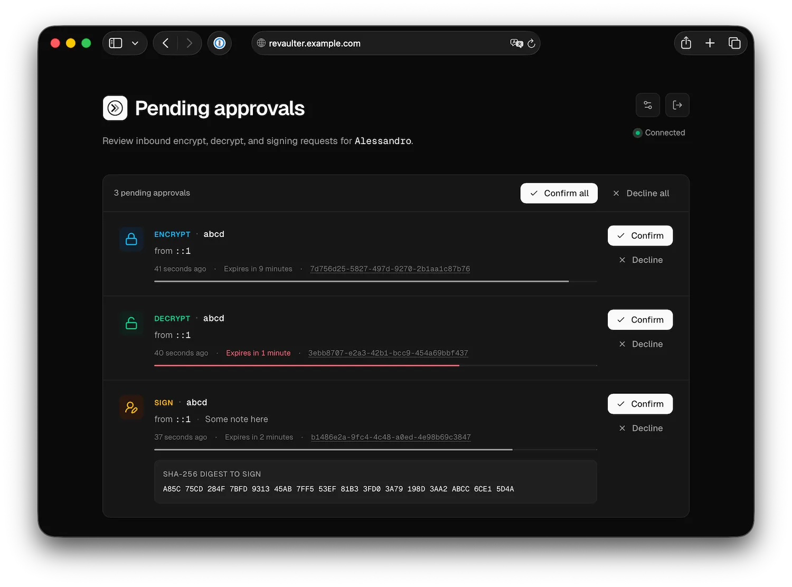
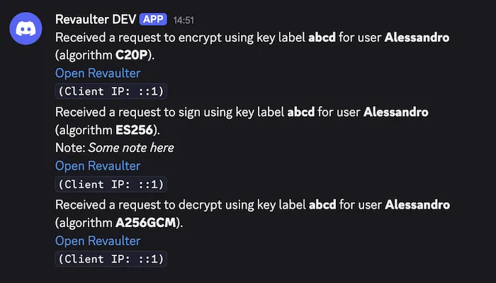

<p align="center">
  
</p>

# Revaulter: Encrypt, decrypt, and sign with passkeys

Encryption keys and signing keys don't belong in environment variables or on disk. Revaulter keeps them in your passkey: scripts submit a request, the passkey holder approves it in their browser, and the browser performs the crypto locally. The server never sees the key or the plaintext — it stores only opaque, encrypted envelopes.

**Use it to:** unlock encrypted disks at boot, wrap database and TLS keys, sign release binaries from CI, protect backup repository passwords, issue long-lived JWTs — all gated behind a passkey approval.



## Usage examples

### Encrypt and decrypt any message

Protect sensitive data with your passkey. Use `revaulter-cli` to encrypt a value, and the passkey holder confirms the operation from their browser:

```bash
MESSAGE=$(echo -n 'my secret message' | base64)
REQUEST_KEY="AbCdEf0123456789GhIj"

# Encrypt
revaulter-cli encrypt \
  --server https://revaulter.example.com \
  --request-key $REQUEST_KEY \
  --key-label my-secret \
  --algorithm A256GCM \
  --value "$MESSAGE"

# Decrypt
revaulter-cli decrypt \
  --server https://revaulter.example.com \
  --request-key $REQUEST_KEY \
  --key-label my-secret \
  --algorithm A256GCM \
  --value <ciphertext> --nonce <nonce> --tag <tag>
```

### Wrap encryption keys safely

Use Revaulter to wrap (encrypt) database encryption keys, TLS private keys, or any other key material. The wrapped key can be stored alongside the data it protects, only someone with the right passkey can unwrap it.

For example, you can use Revaulter together with age to encrypt large files: [see full example](./docs/06-examples.md#encrypting-large-files-with-age-and-revaulter) in the docs.

### Unlock encrypted disks at boot

Integrate Revaulter into your boot process to unlock LUKS/dm-crypt volumes. A script calls `revaulter-cli decrypt` to retrieve the disk encryption key, and an admin authenticates with their passkey to release it. No unattended keys on disk. [See full example](./docs/06-examples.md#unlocking-luks-encrypted-drives-at-boot) in the docs.

### Wrap restic backup repository passwords

Wrap your [restic](https://restic.net) repository password with Revaulter and hook it into restic's `--password-command`. The backup script gets the password only after a passkey holder approves — even a fully compromised backup host can't restore the repository on its own. [See full example](./docs/06-examples.md#backing-up-with-restic) in the docs.

### Sign release binaries from CI

Run `revaulter-cli sign` from a GitHub Actions workflow to produce a signature over a release artifact. The signing key never touches the runner, the workflow pauses while a maintainer approves the request from their phone, and the resulting `.sig` is a 64-byte raw `r || s` ECDSA signature that any ECDSA library can verify. [See full example](./docs/06-examples.md#signing-a-release-binary-from-github-actions) in the docs.

### Issue passkey-approved JWTs

Mint long-lived ES256 JWTs (service-to-service tokens, installer licenses, break-glass credentials) where every issuance is reviewed in-browser before signing. The output is a standard compact JWS verifiable by any JOSE library. [See full example](./docs/06-examples.md#issuing-a-long-lived-jwt) in the docs.

### Verify signatures with a published key

Revaulter publishes the public half of every signing key on a cacheable, unauthenticated endpoint as both PEM and JWK. Verifiers fetch it once, pin it, and run fully offline from then on: there's no runtime dependency on Revaulter. [See full example](./docs/06-examples.md#fetching-a-public-key-to-verify-a-signature) in the docs.

## How it works

1. A CLI or script submits an encrypt or decrypt request to Revaulter
2. The passkey holder gets notified (Discord, Slack, or a webhook)
3. They open the web app, authenticate with their passkey, and review the request
4. On approval, the browser derives the key from the passkey and performs the crypto operation locally
5. The CLI receives the encrypted result and decrypts it locally

Encryption keys are derived from the passkey in the browser (leveraging the PRF extension), they never leave the user's device. The Revaulter server is just a relay: it temporarily stores only opaque, end-to-end encrypted envelopes.



## Key features

- **Passkey-derived keys** — encryption keys are derived from WebAuthn passkeys (with PRF) directly in the browser; the server never has access to them
- **End-to-end encryption** — all cryptographic operations happen in the user's browser using WebCrypto, the server stores only opaque, encrypted envelopes
- **Self-hosted** — runs on your infrastructure, you own your data and keys
- **Webhook notifications** — get notified on Discord, Slack, or any webhook endpoint when a request is waiting
- **Lightweight** — single binary, requires only a database (SQLite or PostgreSQL)
- **Strong cryptography** — includes support for hybrid, quantum-resistant asymmetric cryptography

## Quick start

Run Revaulter with Docker:

```yaml
# docker-compose.yml
services:
  revaulter:
    image: ghcr.io/italypaleale/revaulter:2
    ports:
      - "8080:8080"
    volumes:
      - ./config.yaml:/etc/revaulter/config.yaml:ro
      - ./data:/data
    restart: unless-stopped
```

Create a minimal `config.yaml`:

```yaml
webhookUrl: "https://discord.com/api/webhooks/..."
databaseDSN: "/data/revaulter.db"
secretKey: "<generate with: openssl rand -base64 32>"
baseUrl: "https://revaulter.example.com"
```

Then start the server, open the web UI, and create your first account.

## Documentation

- [What is Revaulter](./docs/01-what-is-revaulter.md) — how it works, security model, webhooks
- [Installing Revaulter](./docs/02-installing-revaulter.md) — Docker setup, configuration reference, Docker Compose and Podman examples
- [Using the CLI](./docs/03-revaulter-cli.md) — commands, flags, and examples
- [Cryptography architecture](./docs/04-crypto-architecture.md) — key layers, wrapping, derivation, transport encryption
- [REST API reference](./docs/05-rest-api-reference.md) — all endpoints with request/response schemas
- [Examples](./docs/06-examples.md) — LUKS disk unlock at boot, encrypting files with age, restic backups, signing release manifests / binaries / JWTs, fetching a public key to verify a signature
- [Audit events](./docs/07-audit-events.md) — durable, queryable record of security-relevant actions; schema, event types, retention, sample SQL

## License

See [LICENSE](./LICENSE).
