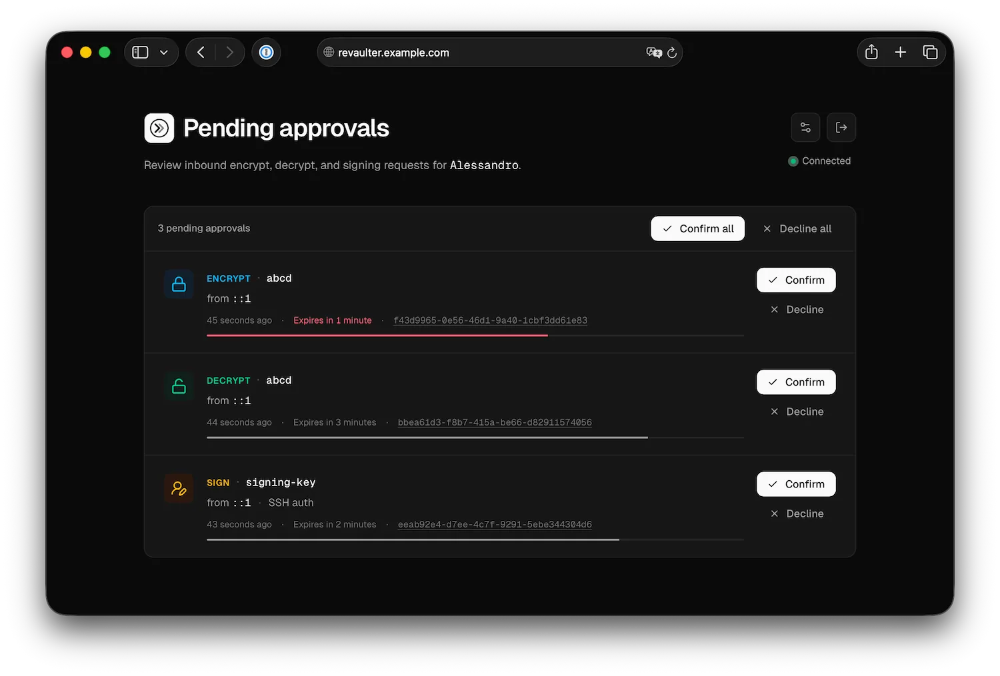

<p align="center">
  
</p>

# Revaulter: Encrypt, decrypt, and sign with passkeys

**[📚 Read the docs](https://revaulter.italypaleale.me)**

Encryption keys and signing keys don't belong in environment variables or on disk. Revaulter keeps them in your passkey: scripts submit a request with the CLI, you approve it in your browser with a passkey, and the browser performs the crypto locally. Everything is End-to-End Encrypted (E2EE) between the CLI and your browser.

**What you can use Revaulter for:**

- [Encrypt/decrypt messages, secrets, keys](https://revaulter.italypaleale.me/examples/encrypt-and-decrypt-short-messages)
- [Unlock encrypted disks at boot](https://revaulter.italypaleale.me/examples/unlocking-luks-encrypted-drives-at-boot)
- [Protect backup repository passwords](https://revaulter.italypaleale.me/examples/backing-up-with-restic)
- [SSH logins with a passkey-backed SSH agent](https://revaulter.italypaleale.me/examples/authenticate-to-ssh-servers)
- [Sign release binaries from CI](https://revaulter.italypaleale.me/examples/signing-a-release-binary-from-github-actions)
- [Issue long-lived JWTs](https://revaulter.italypaleale.me/examples/issuing-a-long-lived-jwt)
- [Encrypt/decrypt very large files with age and Revaulter](https://revaulter.italypaleale.me/examples/encrypting-large-files-with-age-and-revaulter)



## Key features

- **Passkey-derived keys** — encryption keys are derived from WebAuthn passkeys (with PRF) directly in the browser; the server never has access to them
- **End-to-end encryption** — all cryptographic operations happen in the user's browser using WebCrypto, the server stores only opaque, encrypted envelopes
- **Self-hosted** — runs on your infrastructure, you own your data and keys
- **Webhook notifications** — get notified on Discord, Slack, or any webhook endpoint when a request is waiting
- **Lightweight** — single binary, requires only a database (SQLite or PostgreSQL)
- **Strong cryptography** — includes support for hybrid, quantum-resistant asymmetric cryptography

## Quick start

Run Revaulter with Docker:

```yaml
# docker-compose.yml
services:
  revaulter:
    image: ghcr.io/italypaleale/revaulter:2
    ports:
      - "8080:8080"
    volumes:
      - ./config.yaml:/etc/revaulter/config.yaml:ro
      - ./data:/data
    restart: unless-stopped
```

Create a minimal `config.yaml`:

```yaml
webhookUrl: "https://discord.com/api/webhooks/..."
databaseDSN: "/data/revaulter.db"
secretKey: "<generate with: openssl rand -base64 32>"
baseUrl: "https://revaulter.example.com"
```

Then start the server, open the web UI, and create your first account.

## Documentation

All documentation lives on the [website](https://revaulter.italypaleale.me).

Quick links:

- [What is Revaulter](https://revaulter.italypaleale.me/docs/what-is-revaulter/) — how it works, security model, webhooks
- [Installing Revaulter](https://revaulter.italypaleale.me/docs/installing-revaulter/) — Docker setup, configuration reference, Docker Compose and Podman examples
- [Using the CLI](https://revaulter.italypaleale.me/docs/revaulter-cli/) — commands, flags, and examples
- [Cryptography architecture](https://revaulter.italypaleale.me/docs/crypto-architecture/) — key layers, wrapping, derivation, transport encryption

## License

Revaulter is open source software released under a permissive MIT license. See [LICENSE](./LICENSE).
