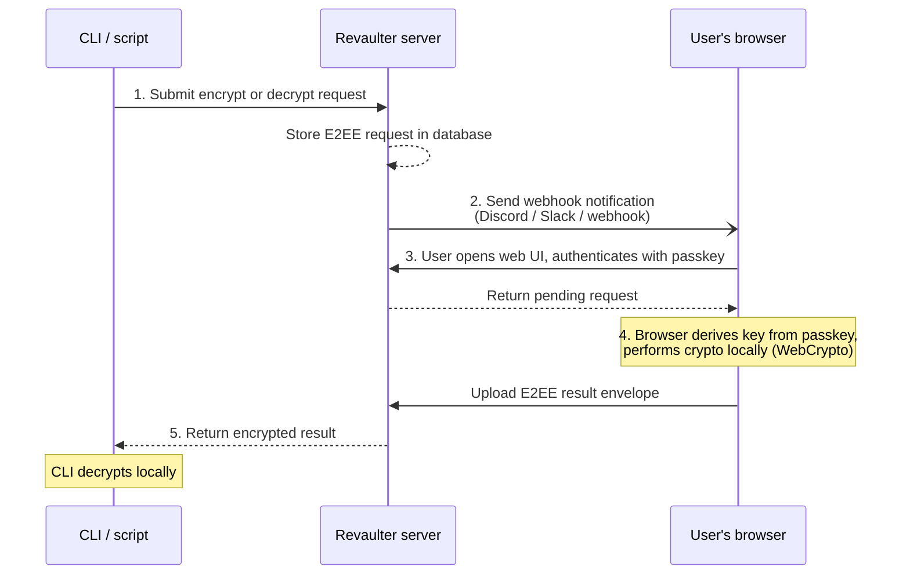

# What is Revaulter

Revaulter is a self-hosted service that turns WebAuthn passkeys into encryption keys. Instead of storing keys on a server or in a vault, Revaulter derives them from a passkey directly in the user's browser; the server never sees them. When a CLI or script needs to encrypt or decrypt something, the passkey holder authenticates and the browser performs the operation locally.

## How it works

1. A CLI or script submits an encrypt or decrypt request to Revaulter, identified by a per-user request key.
2. Revaulter stores the end-to-end encrypted (E2EE) request in its database and sends a webhook notification to the passkey holder.
3. The user opens the Revaulter web UI and authenticates with their WebAuthn passkey (with optional password second factor).
4. The browser derives the encryption key from the passkey via WebAuthn PRF, performs the cryptographic operation locally using WebCrypto, and encrypts the result back to the CLI. The server never sees the plaintext or the user's keys.
5. The encrypted result is relayed back to the CLI, which decrypts it locally using its ephemeral private key.

## Security model

Encryption keys are derived from the passkey in the browser and never leave the user's device. The server acts as a relay, not a key service:

- Passkey-derived keys — the user's primary key is derived from the WebAuthn PRF extension output, so it only exists when the passkey holder authenticates.
- The server never derives or holds the user's primary key.
- The server never performs the requested encryption or decryption itself.
- The server never sees plaintext payloads: it stores only opaque, encrypted envelopes.
- All sensitive cryptographic operations happen in the user's browser using the [Web Crypto API](https://developer.mozilla.org/en-US/docs/Web/API/Web_Crypto_API).
- Request payloads are encrypted end-to-end between the CLI and the browser.
- Response envelopes use hybrid ECDH P-256 + ML-KEM-768 key agreement for post-quantum transport security.

For a full description of the cryptographic architecture, see [Cryptography architecture](./04-crypto-architecture.md).

## Self-hosted

Revaulter is designed to run on your own infrastructure. You deploy the server, you own the database, and you control access. There are no external dependencies or third-party services required beyond what you configure (e.g., a webhook endpoint for notifications).

Requirements are minimal:

- A container runtime (Docker, Podman, etc.)
- A database: **SQLite** (file-based) or **PostgreSQL**
- HTTPS access for the web UI, via TLS certificates or a reverse proxy (HTTPS is required because of WebCrypto)

See [Installing Revaulter](./02-installing-revaulter.md) for setup instructions.

## Webhook notifications

When a request is submitted, Revaulter sends a webhook notification so the passkey holder knows a request is waiting. Three formats are supported:

| Format | Description |
|--------|-------------|
| `plain` | Plain text body (`text/plain`) — works with any generic webhook consumer |
| `slack` | Slack-compatible JSON payload — works with Slack and Slack-compatible services |
| `discord` | Discord webhook — uses Slack-compatible format via Discord's `/slack` endpoint |

Webhook notifications include:

- The operation type (encrypt or decrypt)
- The key label and algorithm
- The requestor's IP address
- An optional note from the CLI
- A link to open the Revaulter web UI

An optional `webhookKey` configuration value lets you send an `Authorization` header with each webhook request.

## Supported operations

Revaulter currently supports two operations:

- **Encrypt** — encrypt a plaintext value
- **Decrypt** — decrypt a ciphertext value

Both operations use the `aes-gcm-256` algorithm. The key used for each operation is derived deterministically from the passkey holder's primary key, the key label, and the algorithm. See the [cryptography architecture](./04-crypto-architecture.md) for details.
