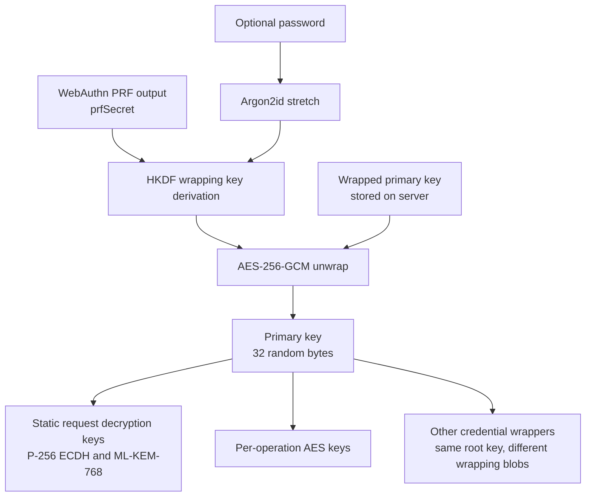
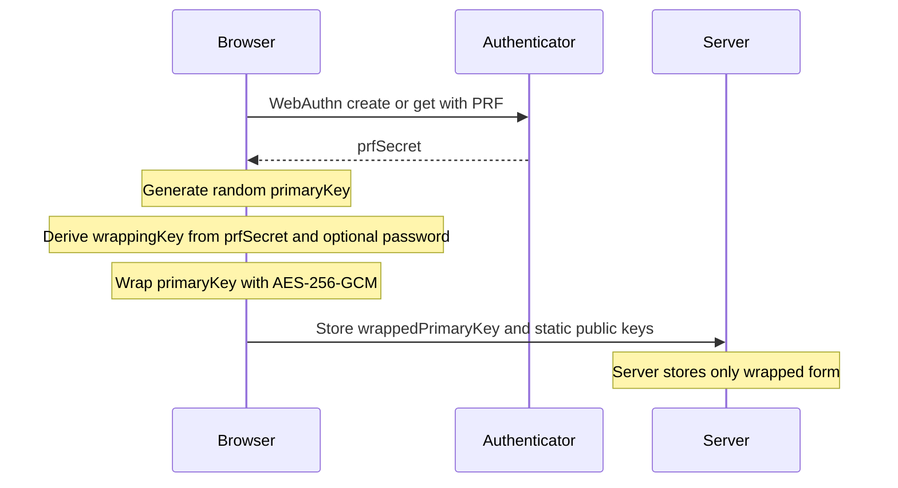
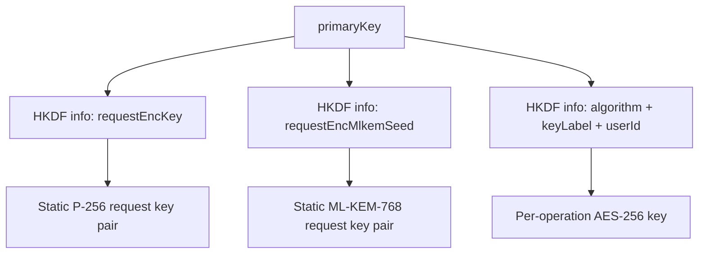
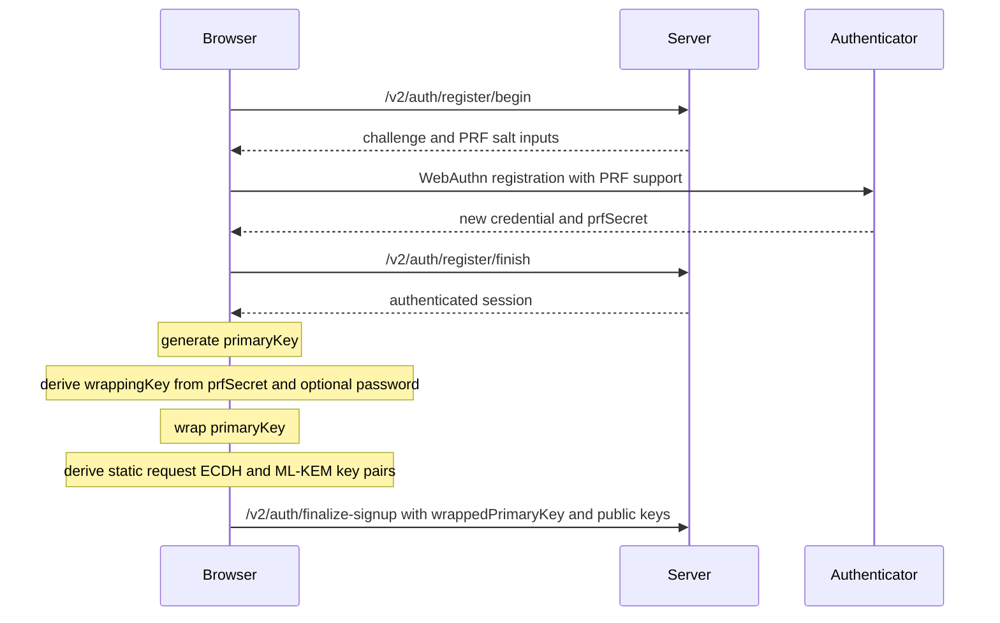
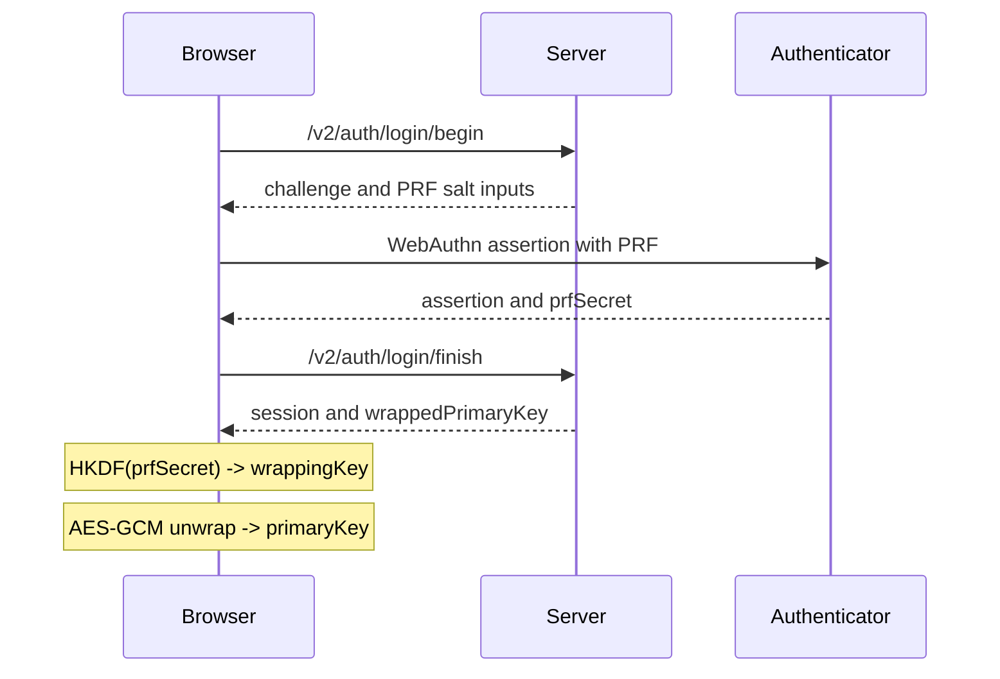
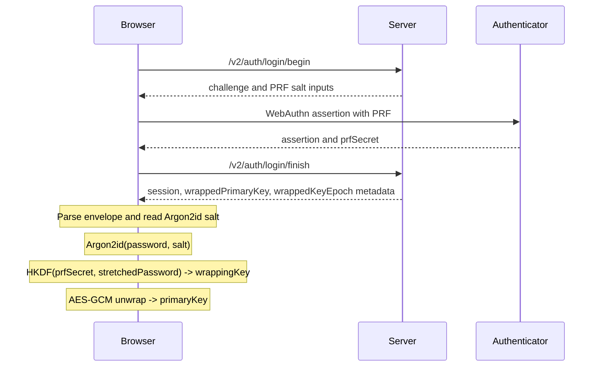
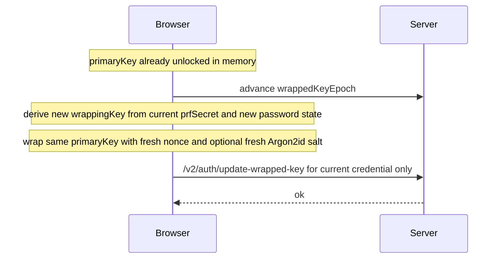
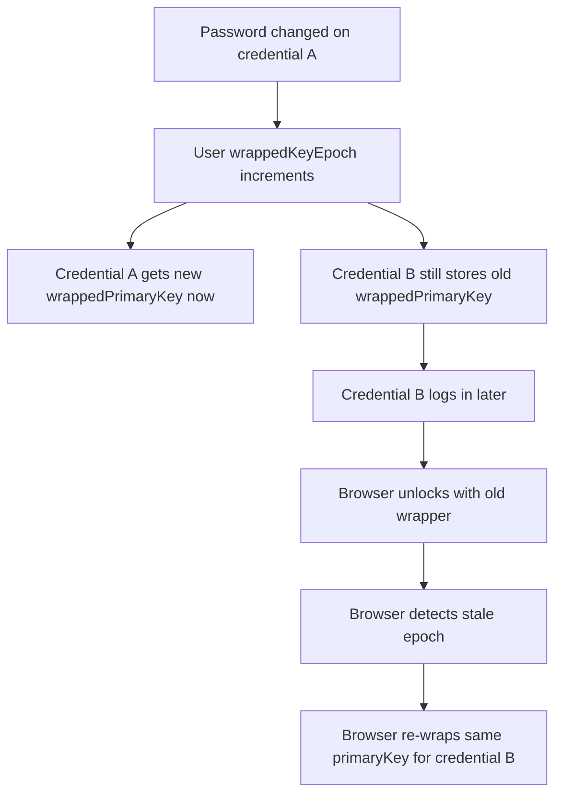
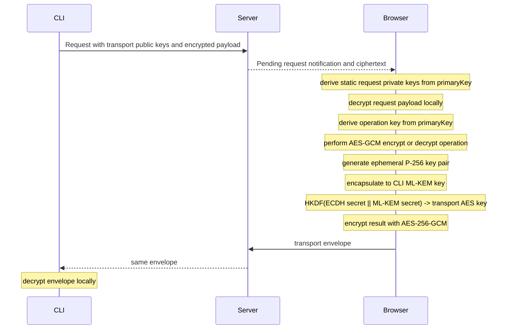

# Cryptography Architecture

## Scope

This document describes the cryptography used by Revaulter v2 as it exists today in the browser client, CLI protocol, and server-side storage model.
It focuses on how WebAuthn PRF, WebCrypto, optional passwords, the primary key, and request/response envelopes fit together.

Revaulter is designed so the server relays and stores encrypted material, but the browser performs the sensitive cryptographic operations.
The server never derives the user's primary key, never performs the requested application encryption or decryption itself, and never sees clear-text payloads.

## High-level model

Revaulter has three distinct key layers:

1. `prfSecret`: a 32-byte secret returned by the authenticator through the WebAuthn PRF extension during login
2. `primaryKey`: a random 32-byte root key generated in the browser and stored on the server only in wrapped form
3. Derived keys: deterministic keys derived from the `primaryKey` for request decryption, response transport encryption, and application operations



## Browser-side crypto and WebCrypto usage

The browser uses WebCrypto for the following operations:

- Generating the random 256-bit `primaryKey`
- HKDF-SHA-256 derivation for wrapping keys, transport keys, and operation keys
- AES-256-GCM wrap and unwrap of the `primaryKey`
- AES-256-GCM encrypt and decrypt for the requested application operation
- P-256 ECDH key generation, import, export, and shared-secret derivation for response transport

Outside WebCrypto, the browser currently uses:

- WebAuthn with the PRF extension to get `prfSecret`
- [`hash-wasm`](https://github.com/Daninet/hash-wasm) Argon2id to stretch the optional password
- [`mlkem-wasm`](https://github.com/dchest/mlkem-wasm) for ML-KEM-768 encapsulation and decapsulation in the hybrid transport path

The split matters:

- WebCrypto covers the symmetric crypto, HKDF, and ECDH pieces with the browser's native cryptographic implementation
- Argon2id and ML-KEM are currently provided by WASM libraries because they are not generally exposed by WebCrypto

## WebCrypto security notes

Revaulter uses browser-based cryptography, so the security of the application depends in part on the integrity of the browser execution environment.

Important constraints:

- WebCrypto must run in a secure context, which in practice means `https://` or `http://localhost`
- The app implements a Content Security Policy to reduce script injection risk and to harden the browser environment around the crypto code (if you run your own proxy in front of Revaulter, make sure to preserve the CSP headers)
- Even with CSP and secure-context requirements, browser-based crypto always carries residual risk because the code handling secrets executes in a general-purpose client runtime

Despite all possible mitigations, there is still a residual risk inherent with the use of browser-based cryptography:

- A malicious script that executes in the page context could potentially access plaintext inputs, the in-memory `primaryKey`, or operation results before they are re-encrypted (the primary key is only maintained in-memory and not stored in local/session storage or in a cookie to reduce this risk)
- Browser extensions, compromised dependencies, browser implementation bugs, or client-device compromise can weaken the security assumptions around in-browser cryptography
- Revaulter reduces server-side exposure, but it does not eliminate the inherent trust placed in the browser and endpoint device

## Primary key lifecycle

The `primaryKey` is the root secret for a user account.
It is generated once in the browser during setup and reused across passkeys by re-wrapping it for each credential.

Properties:

- Size: 32 bytes
- Generation: browser-side random generation through WebCrypto
- Storage: only as a wrapped blob on the server
- Exposure: kept in-memory in the browser after successful login or password unlock



## Wrapping key derivation

The wrapping key is what encrypts and authenticates the `primaryKey` for storage.
It is derived from two factors:

- Required factor: `prfSecret` from WebAuthn PRF
- Optional factor: user password

### Without a password

When the user has no password configured, the wrapping key is derived directly from the PRF output with HKDF-SHA-256:

```text
wrappingKey = HKDF-SHA-256(
  IKM  = prfSecret
  salt = empty
  info = "revaulter/v2/primaryKeyWrap\nuserId={userId}\nv=1"
  len  = 32 bytes
)
```

### With a password

When a password is configured, the password is first stretched with Argon2id and the stretched output becomes the HKDF salt:

```text
stretched = Argon2id(
  password,
  salt = 16 random bytes,
  m = 128 MiB,
  t = 4,
  p = 1,
  hashLen = 32
)

wrappingKey = HKDF-SHA-256(
  IKM  = prfSecret,
  salt = stretched,
  info = "revaulter/v2/primaryKeyWrap\nuserId={userId}\nv=1",
  len  = 32 bytes
)
```

Why this construction:

- The PRF output gives a high-entropy authenticator-bound secret
- The password adds a second factor without becoming the direct encryption key
- Argon2id raises the cost of offline password guessing if an attacker ever obtains both a wrapped key blob and the corresponding PRF secret, protecting against a compromise of the WebAuthn authenticator (passkey)
- The `userId` in HKDF `info` domain-separates wrapping keys across accounts

## Wrapped primary key format

The primary key is wrapped with AES-256-GCM.

Parameters:

- Key: 32-byte `wrappingKey`
- Nonce: random 12 bytes
- Plaintext: 32-byte `primaryKey`
- AAD: `revaulter/v2/wrapped-primary-key\nuserId={userId}\nv=1`

The stored blob is a base64url-encoded JSON envelope:

When there's a password:

```json
{
  "v": 1,
  "passwordRequired": true,
  "argon2id": {
    "m": 131072,
    "t": 4,
    "p": 1,
    "salt": "<base64url>"
  },
  "nonce": "<base64url>",
  "ciphertext": "<base64url>"
}
```

Without passwordsç

```json
{
  "v": 1,
  "passwordRequired": false,
  "nonce": "<base64url>",
  "ciphertext": "<base64url>"
}
```

Successful AES-GCM unwrap is the password check and the passkey check upon sign in.

## Deriving keys from the primary key

Once the browser has the unwrapped `primaryKey`, all further account-level crypto keys are derived from it with HKDF-SHA-256.
The current implementation uses an empty HKDF salt and purpose-specific `info` strings.

### Request decryption ECDH key pair

The browser derives a stable request-encryption P-256 ECDH private scalar from the `primaryKey`.

Process:

1. HKDF derives 384 bits with `info = revaulter/v2/requestEncKey\nuserId={userId}\nv=1`
2. The 384-bit output is reduced to a valid P-256 scalar using the FIPS 186-5 candidate-reduction method
3. The scalar is imported as a P-256 ECDH private key
4. The corresponding public key is exported and stored on the server during signup finalization

The extra 384-bit derivation length is deliberate. It keeps modular reduction bias negligible when mapping HKDF output into the P-256 scalar field.

### Request decryption ML-KEM key pair

The browser also derives a stable ML-KEM-768 key pair from the same `primaryKey`.

Process:

1. HKDF derives 512 bits with `info = revaulter/v2/requestEncMlkemSeed\nuserId={userId}\nv=1`
2. That seed is used to deterministically derive the ML-KEM-768 key pair
3. The public key is stored on the server during signup finalization

These two static public keys let the CLI encrypt request payloads end-to-end to the browser without the server being able to decrypt them.

### Operation keys

For each actual requested encryption or decryption operation, the browser derives a 256-bit AES key from the `primaryKey` using:

```text
info = "algorithm={algorithm}\nkeyLabel={keyLabel}\nuserId={userId}\nv=1"
```

This means the same account root key can deterministically produce distinct operation keys for different labels and algorithms.



## Signup flow

Signup is split so the server first creates the user and credential record, then the browser finishes local cryptographic setup and uploads the wrapped key and static public keys.



At this stage the server stores:

- User record with request routing metadata and user-level `wrappedKeyEpoch`
- Credential record with that credential's `wrappedPrimaryKey`
- Static request decryption public keys

## Login and unlock flow

### Passwordless account

If the wrapped envelope says `passwordRequired: false`, login is a one-step unwrap after WebAuthn:



### Password-protected account

If the wrapped envelope says `passwordRequired: true`, login becomes a WebAuthn step followed by local password unlock:



Notable behavior:

- Password bytes are used exactly as entered
- Unlock failure (generally indicating an incorrect password) is detected only by AES-GCM authentication failure during unwrap

## Changing or removing the password

Changing the password does not change the `primaryKey`.
It only changes how that same `primaryKey` is wrapped for the currently authenticated credential.

Current implementation steps:

1. The browser must already have `prfSecret`, the unwrapped `primaryKey`, and the active credential ID in memory
2. The browser increments the user-level `wrappedKeyEpoch`
3. The browser derives a new wrapping key using the current passkey's `prfSecret` and the new password, or no password if removing it
4. The browser wraps the same `primaryKey` into a new envelope with a fresh nonce and, when applicable, a fresh Argon2id salt
5. The browser uploads the new wrapped blob only for the currently authenticated credential



This is a re-wrap, not a re-key:

- The account root key stays the same
- Derived operation keys stay the same
- Existing encrypted data does not need to be re-encrypted

## Multi-passkey behavior and wrapped-key epochs

Each credential stores its own wrapped copy of the same `primaryKey`.
That is necessary because each passkey yields a different `prfSecret`, so each credential needs its own wrapper.

The user record also stores a user-level `wrappedKeyEpoch`.
That epoch is used to detect that some credentials still have stale wrappers.

Behavior after a password change:

- The credential used to perform the password change is updated immediately
- Other credentials keep their older wrapped blob until they log in again
- On login, the server tells the browser whether the credential's wrapped-key epoch is stale
- The browser can still unlock using the old wrapper
- After successful unlock, the browser immediately re-wraps the same `primaryKey` for that credential and uploads a fresh wrapper at the current epoch



This design avoids global re-encryption work while still converging every credential to the current password state over time.

## Request encryption path

When the CLI submits an encrypt or decrypt request, it does not send the sensitive request body in plaintext to the server.
Instead it encrypts the request to the browser's static request keys derived from the `primaryKey`.

High-level shape:

1. Browser derives static request private keys from `primaryKey`
2. CLI uses the corresponding server-stored public keys to build an end-to-end encrypted request payload
3. Server stores and relays that ciphertext
4. Browser decrypts the request locally after the user approves it

The request AAD format is deterministic and currently follows:

```text
aad = "algorithm={algorithm}\nkeyLabel={keyLabel}\noperation={encrypt|decrypt}\nv=1"
```

That binds the encrypted request to the intended algorithm and key label.

## Response transport encryption path

The browser sends the result back to the CLI through a separate transport envelope.
This path is hybrid:

- Key agreement using hybrid P-256 ECDH + ML-KEM-768
- Key derivation using HKDF-SHA-256
- Encryption with AES-256-GCM

The browser generates a fresh ephemeral P-256 key pair for each response.
It also encapsulates to the CLI's ML-KEM public key.
The ECDH shared secret and ML-KEM shared secret are concatenated and expanded with HKDF into an AES-256-GCM key.

Current HKDF `info` for transport is:

```text
info = "revaulter/v2/transport/{state}"
```

The transport AAD is deterministic and currently serialized as:

```text
aad = "algorithm={algorithm}\noperation={encrypt|decrypt}\nstate={state}\nv=1"
```



This hybrid transport gives the response envelope both conventional ECDH confidentiality and a post-quantum KEM component.

## Algorithms in use

| Purpose | Algorithm |
|---------|-----------|
| Authenticator-bound secret | WebAuthn PRF |
| Password stretching | Argon2id (`m=128 MiB`, `t=4`, `p=1`, `hashLen=32`) |
| Key derivation | HKDF-SHA-256 |
| Wrapped primary key encryption | AES-256-GCM |
| Application encrypt/decrypt operation | AES-GCM via WebCrypto |
| Static request key agreement | ECDH P-256 |
| Response transport KEM | ML-KEM-768 |
| Response transport AEAD | AES-256-GCM |

## Security properties and consequences

- The server cannot perform user cryptographic operations because it never has the unwrapped `primaryKey`
- A passkey change or password change normally requires only re-wrapping, not re-encrypting application data
- A successful unwrap authenticates the wrapper contents, the passkey-derived PRF input, and the optional password in one step
- Distinct HKDF `info` strings domain-separate wrapping keys, static request keys, transport keys, and operation keys
- User ID and request metadata are bound into AAD or HKDF context to prevent cross-context key reuse
