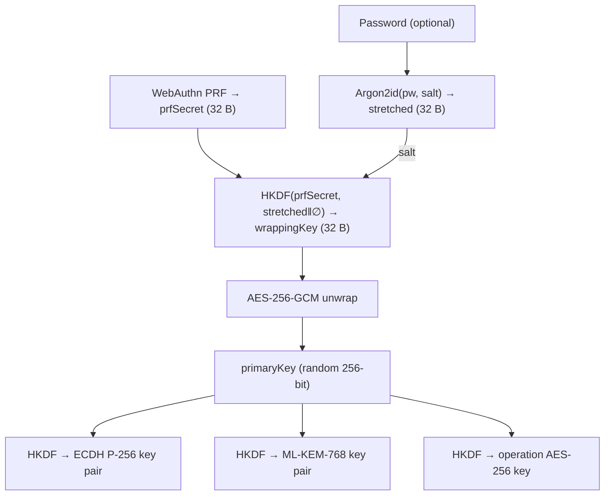
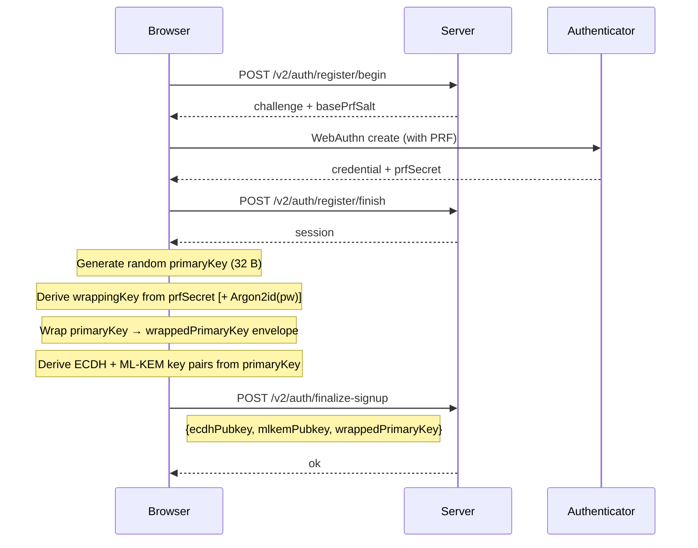
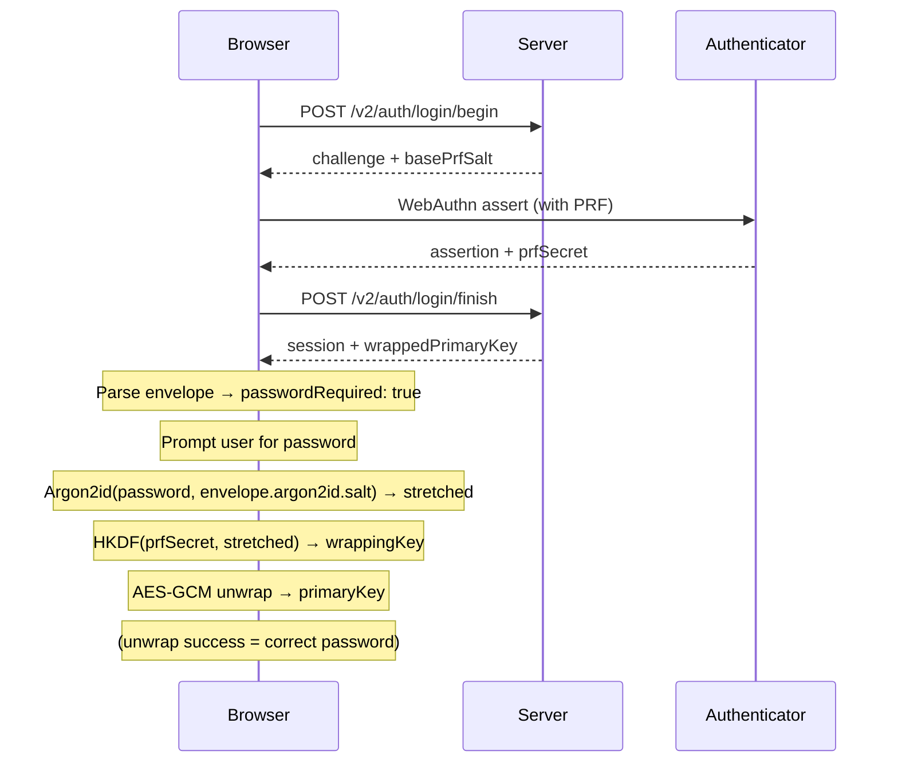
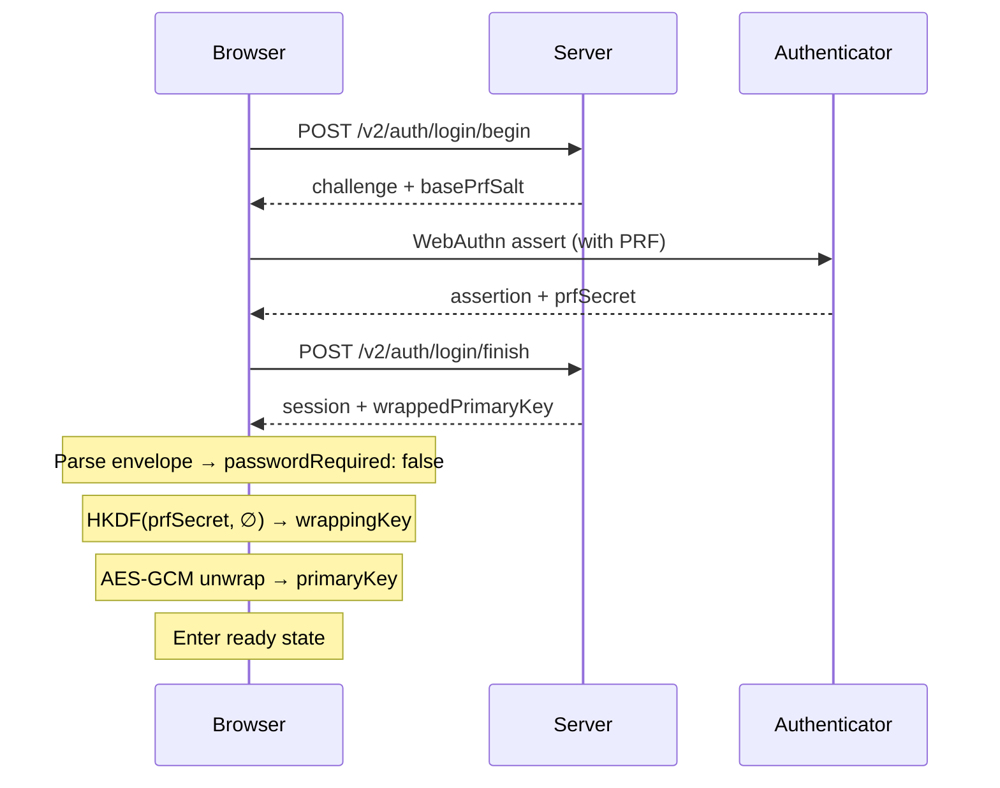
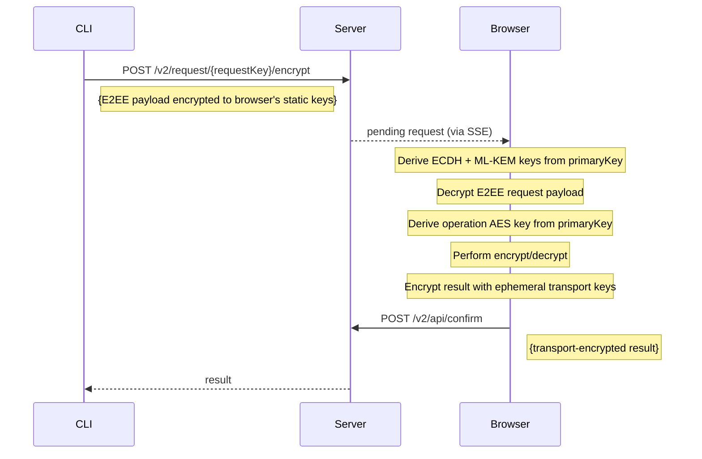

# Crypto Architecture: Primary Key Wrapping

## Overview

All encryption keys (request encryption ECDH/ML-KEM keys, operation AES keys) are derived from a randomly-generated 256-bit **primary key**.
The primary key is wrapped (encrypted) with a key derived from the WebAuthn PRF output and an optional Argon2id-stretched password, then stored on the server.

This architecture decouples encryption keys from the specific passkey: changing or rotating a passkey changes the PRF output, but only requires re-wrapping the primary key — not re-encrypting all stored data.
A successful unwrap proves credential and password correctness, replacing the separate password canary.

> **Security note:** The `wrappedPrimaryKey` blob is sensitive encrypted root-key material.
> It must never be logged, echoed back in diagnostics, or exposed through telemetry.

## Key Hierarchy



## Cryptographic Design

### Wrapping key derivation

```
If password is set:
  1. stretched = Argon2id(password, argon2id_salt,
                          m=128 MiB, t=4, p=1, hashLen=32)
  2. wrappingKey = HKDF-SHA256(
       IKM  = prfSecret,
       salt = stretched,
       info = "revaulter/v2/primaryKeyWrap\nuserId={userId}\nv=1",
       len  = 32)

If no password:
  wrappingKey = HKDF-SHA256(
       IKM  = prfSecret,
       salt = ∅,
       info = "revaulter/v2/primaryKeyWrap\nuserId={userId}\nv=1",
       len  = 32)
```

Argon2id is applied when a password is present because passwords can be low-entropy.
An attacker who obtains both the wrapped primary key (server compromise) and the PRF output (stolen passkey) could brute-force a weak password in the HKDF-only scheme.
Argon2id makes that infeasible.
When no password is set, HKDF alone is sufficient since the PRF output is 256-bit high-entropy.

### Primary key wrapping (AES-256-GCM)

| Parameter  | Value |
|------------|-------|
| Key        | wrappingKey (32 bytes) |
| Nonce      | random 12 bytes |
| Plaintext  | primaryKey (32 bytes) |
| AAD        | `revaulter/v2/wrapped-primary-key\nuserId={userId}\nv=1` |

### Wrapped key envelope format

The wrapped key is stored as a base64url-encoded JSON envelope:

```json
{
  "v": 1,
  "passwordRequired": true,
  "argon2id": {
    "m": 131072,
    "t": 4,
    "p": 1,
    "salt": "<base64url>"
  },
  "nonce": "<base64url>",
  "ciphertext": "<base64url>"
}
```

When `passwordRequired` is `false`, the `argon2id` object is omitted.

### Key derivation from primary key

All keys are derived via HKDF-SHA256 with `IKM = primaryKey` and `salt = ∅`:

| Purpose | Info string | Output length |
|---------|-------------|---------------|
| Request enc ECDH | `revaulter/v2/requestEncKey\nuserId={userId}\nv=1` | 384 bits |
| Request enc ML-KEM | `revaulter/v2/requestEncMlkemSeed\nuserId={userId}\nv=1` | 512 bits |
| Operation key | `algorithm={alg}\nkeyLabel={label}\nuserId={userId}\nv=1` | 256 bits |

## Flows

### Signup flow



### Login flow (with password)



### Login flow (no password)



### Encrypt/decrypt operation



## Security Properties

- **Passkey independence:** Changing a passkey changes the PRF output, but only requires re-wrapping the primary key — not re-deriving all keys
- **Password verification:** A successful AES-GCM unwrap authenticates both the passkey (PRF) and the password (Argon2id salt), replacing the separate password canary
- **Offline attack resistance:** Argon2id (128 MiB, 4 iterations) makes brute-forcing a weak password infeasible even with access to both the wrapped key and PRF output
- **Key binding:** AAD in both wrapping and derivation binds keys to the user ID, preventing cross-user key substitution
- **Rate limiting:** The server rate-limits delivery of the wrapped primary key to 5 per hour per user after WebAuthn authentication
- **No password normalization:** Passwords are treated as exact user-provided byte strings with no trimming, lowercasing, or Unicode normalization

## Threat Model Notes

The wrapped primary key blob is more sensitive than the old password canary.
An attacker who obtains this blob (e.g. via server compromise) and later also obtains the PRF output from a compromised authenticator could:

1. Without password: directly derive the wrapping key and unwrap the primary key
2. With password: attempt offline brute-force against the Argon2id-protected password

The Argon2id parameters are chosen to make scenario (2) infeasible for non-trivial passwords.
The rate limiter protects against harvesting the blob through repeated WebAuthn logins.
