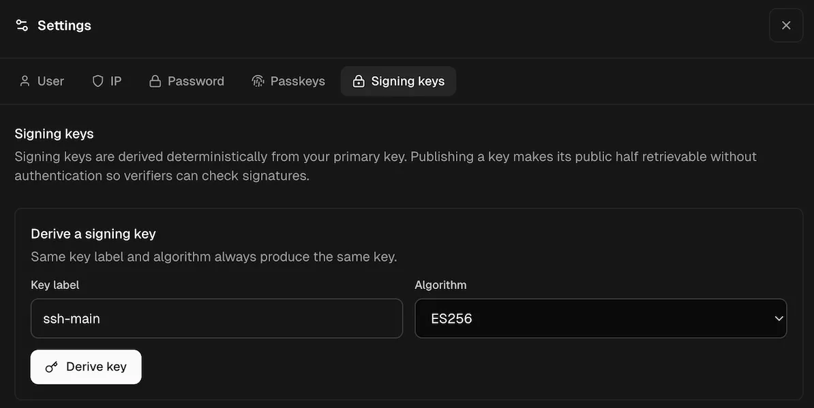

# Using Revaulter as an SSH agent

Revaulter can run as an SSH agent. SSH clients ask the local agent to sign authentication challenges, and the agent routes each signature request through Revaulter so the key holder approves it in the browser with their passkey.

The private signing key never exists on the SSH client or server: the SSH server only needs the public key in `authorized_keys`.

## 1. Create the signing key in the UI

Create the signing key before using the SSH agent:

1. Open the Revaulter web UI and sign in.
2. Open **Settings**.
3. Go to **Signing keys**.
4. Create or generate a signing key for the key label you want to use, for example `ssh-main`.



Note: you do not need to publish the key for SSH agent use.

## 2. Trust the server anchor

Run `revaulter trust` once from a terminal. This pins the server's anchor keys locally so the CLI and SSH agent can detect unexpected server key changes later.

```sh
# For non-interactive setups (like in scripts, add the `--yes` flag)
revaulter trust \
  --server https://revaulter.example.com \
  --request-key "$REVAULTER_REQUEST_KEY"
```

## 3. Start the SSH agent

Start the agent with the same key label you created in the UI.
The default SSH-agent algorithm is `ES256` for backwards compatibility, but `Ed25519` is also supported:

```sh
revaulter ssh-agent \
  --server https://revaulter.example.com \
  --request-key "$REVAULTER_REQUEST_KEY" \
  --key-label ssh-main \
  --algorithm Ed25519
```

The agent prints an `SSH_AUTH_SOCK` export line. Run that line in the shell where you will use `ssh`:

```sh
export SSH_AUTH_SOCK='/path/printed/by/revaulter.sock'
```

You can also choose a socket path yourself:

```sh
revaulter ssh-agent \
  --server https://revaulter.example.com \
  --request-key "$REVAULTER_REQUEST_KEY" \
  --key-label ssh-main \
  --algorithm Ed25519 \
  --socket "$HOME/.revaulter/ssh-agent.sock"

export SSH_AUTH_SOCK="$HOME/.revaulter/ssh-agent.sock"
```

## 4. Add the public key to `authorized_keys`

With `SSH_AUTH_SOCK` pointing at the Revaulter agent, export the public key:

```sh
ssh-add -L
```

Copy the printed public key line into the target account's `~/.ssh/authorized_keys` on the SSH server.

## 5. Connect using the Revaulter agent

After the public key is installed on the server, connect as per usual from a shell that has `SSH_AUTH_SOCK` set:

```sh
ssh user@prod.example.com
```

You can also force OpenSSH to use the Revaulter socket for this connection:

```sh
# If your OpenSSH version does not support `IdentityFile=none`, use `IdentityFile=/dev/null` instead:
ssh \
  -o IdentityAgent="$SSH_AUTH_SOCK" \
  -o IdentityFile=none \
  -o IdentitiesOnly=no \
  user@prod.example.com
```

You can also configure this per host in `~/.ssh/config`:

```sshconfig
Host prod
    HostName prod.example.com
    User user
    IdentityAgent ~/.revaulter/ssh-agent.sock
    IdentityFile none
    IdentitiesOnly no
```

Then connect with:

```sh
ssh prod
```

Each authentication attempt creates a Revaulter signing request. Approve it in the browser to complete the SSH login.

## 6. Sign Git commits with the same agent

Git can sign commits and tags with SSH keys. Since Revaulter exposes the signing key through an SSH agent, Git can use the same agent for commit signing.

Start the Revaulter SSH agent and export `SSH_AUTH_SOCK` as shown above. For Git signing, use a note that makes approval requests easy to identify:

```sh
# We are using a different key label "git-main" to keep the key used for logging into SSH servers and signing Git commits different
revaulter ssh-agent \
  --server https://revaulter.example.com \
  --request-key "$REVAULTER_REQUEST_KEY" \
  --key-label git-main \
  --algorithm Ed25519 \
  --socket "$HOME/.revaulter/ssh-agent.sock"

export SSH_AUTH_SOCK="$HOME/.revaulter/ssh-agent.sock"
```

Configure Git to use SSH signatures and the public key exposed by the agent:

```sh
git config --global gpg.format ssh
git config --global user.signingkey "$(ssh-add -L | head -n1)"
git config --global commit.gpgsign true
```

Now signed commits use Revaulter:

```sh
git commit -S -m "Much improve, so amaze, wow"
```

Each signed commit creates a Revaulter signing request. Approve it in the browser to complete the commit.

If you use GitHub, GitLab, or another forge that verifies SSH commit signatures, add the same public key from `ssh-add -L` to your account as a signing key. This is separate from adding it as an SSH authentication key.

If another SSH agent is configured globally, run Git from a shell where `SSH_AUTH_SOCK` points at the Revaulter socket:

```sh
SSH_AUTH_SOCK="$HOME/.revaulter/ssh-agent.sock" git commit -S -m "Update release manifest"
```
